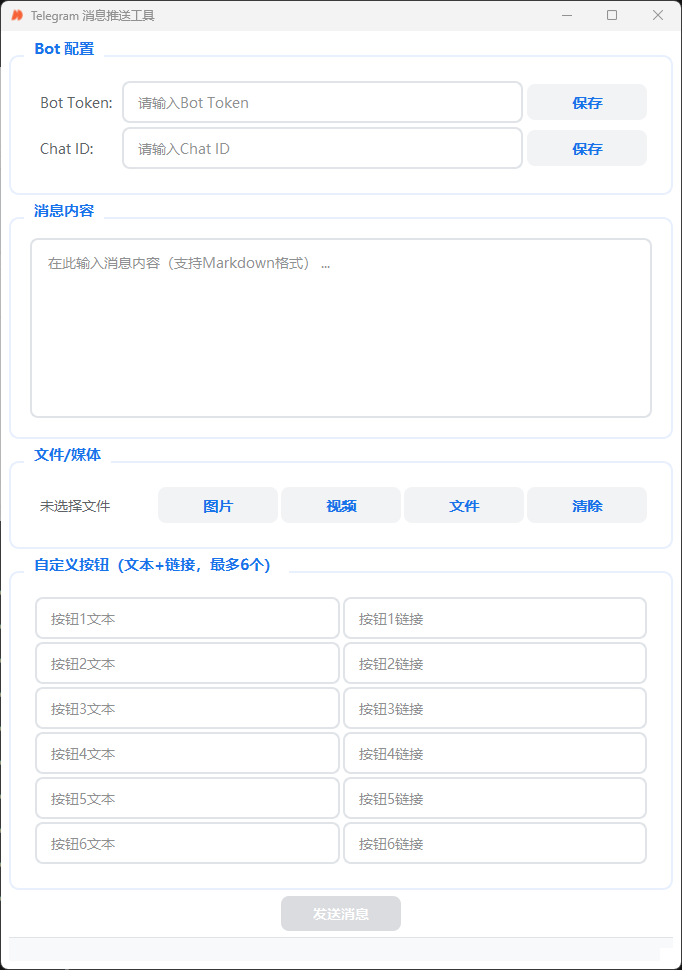

# Telegram 消息推送工具

一个简单易用的Telegram消息推送工具，基于PyQt5开发的图形界面应用程序。支持发送文本消息、图片、视频和文档到Telegram频道或群组。



## 功能特点

- 🎯 简洁美观的图形界面
- 📝 支持发送文本消息（支持Markdown格式）
- 🖼️ 支持发送图片
- 🎥 支持发送视频
- 📄 支持发送任意文件
- 🔗 支持添加自定义按钮（最多6个）
- 💾 自动保存Bot Token和Chat ID配置

## 使用说明

### 1. 配置Bot

1. 在输入框中填入您的Bot Token
2. 填入目标Chat ID
3. 点击"保存"按钮保存配置

### 2. 发送消息

1. 在消息内容框中输入要发送的文本（支持Markdown格式）
2. 如需发送媒体文件，点击相应的按钮选择文件：
   - 图片：支持PNG、JPG、JPEG、BMP、GIF格式
   - 视频：支持MP4、AVI、MOV、MKV格式
   - 文件：支持任意文件类型

### 3. 添加自定义按钮

1. 在"自定义按钮"区域填写按钮文本和链接
2. 最多可添加6个按钮
3. 按钮会在消息下方显示

### 4. 发送

点击"发送消息"按钮即可将内容发送到指定的Telegram频道或群组。

## 注意事项

- 请确保Bot Token格式正确（必须包含冒号）
- Chat ID不能为空
- 消息内容或文件至少需要填写一项
- 发送前请确保网络连接正常

## 技术特点

- 使用PyQt5构建现代化界面
- 采用Material Design风格设计
- 支持配置文件持久化
- 优雅的错误处理和状态提示

## 使用教程

### 环境准备

1. 安装Python 3.8或更高版本
2. 安装必要的依赖：
   ```bash
   pip install -r requirements.txt
   ```
3. 安装PyInstaller：
   ```bash
   pip install pyinstaller
   ```

### 操作步骤

1. 确保所有依赖都已正确安装
2. 在项目根目录下运行打包命令：
   ```bash
   pyinstaller --onefile --noconsole --icon=logo.ico --add-data "logo.png;." main.py
   ```
   参数说明：
   - `--onefile`: 生成单个可执行文件
   - `--noconsole`: 不显示控制台窗口
   - `--icon`: 设置应用图标
   - `--add-data`: 添加额外资源文件

3. 打包完成后，可执行文件将在 `dist/main` 目录下生成

### 打包注意事项

- 确保 `logo.png` 和 `logo.ico` 文件存在于项目目录中
- 如果使用了其他资源文件，需要在打包命令中添加相应的 `--add-data` 参数
- 打包后的程序首次运行可能会被杀毒软件拦截，需要添加信任
- 建议在打包前先测试程序是否正常运行

### 文件说明

打包后的目录结构：
```
dist/main/
├── main.exe          # 主程序
├── logo.png          # 程序图标
└── [其他依赖文件]
```
